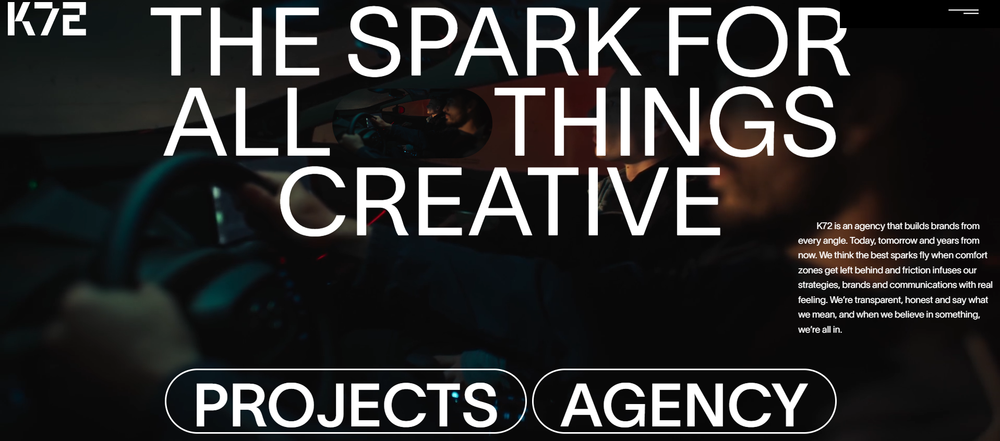
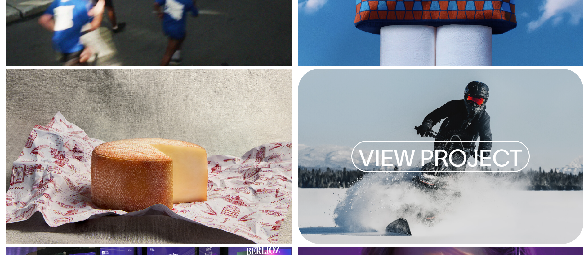
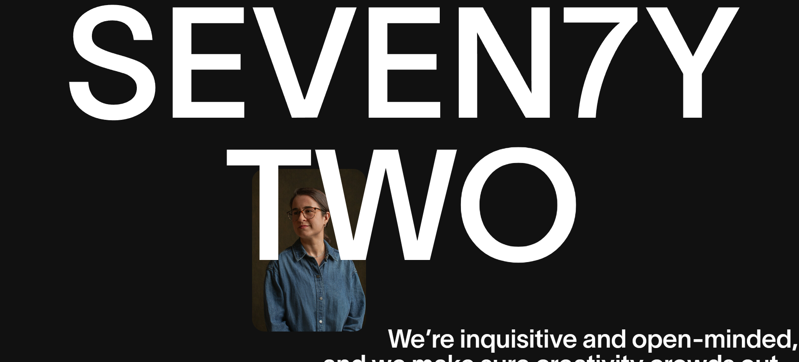
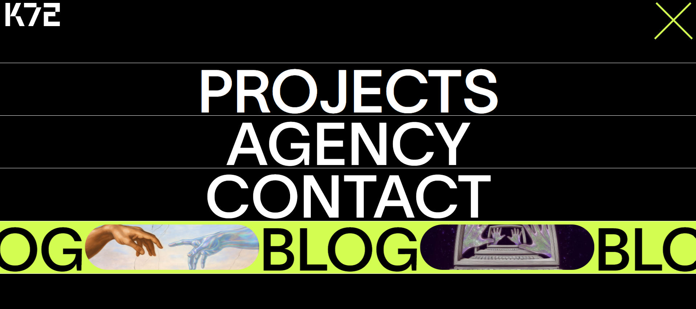

K72 Website Clone

A responsive frontend clone of the K72 website built using React and Vite. This project recreates the look and feel of the original website while following modern React development practices and a component-based architecture.

🚀 Features
Responsive user interface
Component-based React architecture
Fast development with Vite
Clean and organized project structure
Modern CSS styling
Optimized performance
🛠️ Tech Stack
React
Vite
JavaScript (ES6+)
HTML5
CSS3

## Screenshots

### Home Page

### Projects Page

### Agency Page

### Menu Page

